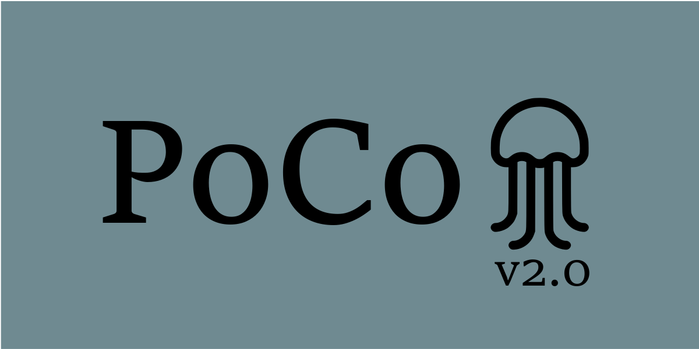

# PoCo-V2 (Polyp Counter)

<p align="center">
  
</p>

The [PoCo v2.0](https://github.com/VitjanZ/PoCo_V2) Vicos Demo port.

# Reference
If you use this tool, please cite the following paper:
```
@article{ZAVRTANIK2020103399,
title = "A segmentation-based approach for polyp counting in the wild",
journal = "Engineering Applications of Artificial Intelligence",
volume = "88",
pages = "103399",
year = "2020",
issn = "0952-1976",
doi = "https://doi.org/10.1016/j.engappai.2019.103399",
url = "http://www.sciencedirect.com/science/article/pii/S095219761930315X",
author = "Vitjan Zavrtanik and Martin Vodopivec and Matej Kristan"
}
```
